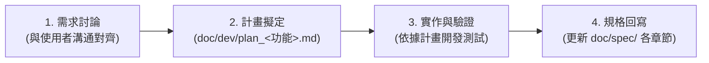

# AI 協作代理準則 (AGENTS.md)

本文件定義 AI 程式設計代理（Agent）在此專案中的核心運作準則、工作流程規範與程式碼品質標準。所有參與本專案開發的 AI 代理皆必須嚴格遵守以下準則。

---

## 🎯 核心工作流程規範 (Workflow Rules)

本專案實施「**先討論、再計畫、後實作、終回寫**」之四階段開發生命週期：

### 階段一：功能開發前討論 (Pre-Development Discussion)
- **嚴禁未經討論逕行大改程式碼**。
- 收到新功能或大型重構需求時，先與使用者深入釐清：
  - 核心痛點與業務場景。
  - 影響的資料結構（Data Schema）與 API 介面。
  - 前端 UI / UX 互動流程。

### 階段二：撰寫開發計畫 (Planning in `doc/dev/`)
- 討論取得共識後，必須在 `doc/dev/` 資料夾中建立計畫文件。
- **檔案命名規則**：`doc/dev/plan_<功能名稱>.md`（例如：`doc/dev/plan_rfi_pdf_export.md`、`doc/dev/plan_user_auth_jwt.md`）。
- **計畫內容必須包含**：
  1. 功能目標與使用情境。
  2. 架構異動評估（涉及之前端組件、後端 API、資料模型）。
  3. 詳細實作步驟清單。
  4. 測試與驗證規劃（自動測試指令、手動驗證流程）。
- **實作期間必須隨時參照此計畫**，確保實作不偏離原定架構。

### 階段三：實作與驗證 (Implementation & Verification)
- 嚴格依照核准的 `plan_<功能名稱>.md` 進行開發。
- 程式碼遵循 TypeScript 嚴格型別檢查，不得忽視 linter 與編譯警告。
- 遵循 Windows 本地環境規範（見下方章節），確保啟動與關閉腳本正常。
- 實作完成後執行全套驗證：型別檢查 (`npx tsc --noEmit`)、建置測試 (`npm run build`) 與 API 功能測試。

### 階段四：功能完成後回寫規格 (Post-Development Spec Sync)
- 功能開發驗證完畢後，**必須將最新功能規格更新回 `doc/spec/` 對應章節**。
- **規格必須分章節撰寫**，各章節職責分明：
  - `doc/spec/01_系統架構與環境規格.md`
  - `doc/spec/02_敏捷看板與任務管理規格.md`
  - `doc/spec/03_工程疑義_RFI_追蹤規格.md`
  - `doc/spec/04_AI工程顧問輔助規格.md`
  - `doc/spec/05_通知與活動日誌規格.md`
  - `doc/spec/06_API介面與資料模型規格.md`
  - 若為全新獨立大模組，經規劃後於 `doc/spec/` 新增對應章節編號檔案（例如 `07_報表匯出與列印規格.md`）。

---

## 💻 技術與環境規範 (Technical & Environment Standards)

### 1. Windows 本地環境相容性
- **繁體中文編碼保護**：
  - PowerShell 腳本 (`.ps1`) 必須包含 **UTF-8 BOM (`\uFEFF`)**，避免 Windows PowerShell 5.1 在 Big5 (CP950) 系統中因「許功蓋」字元（如「埠」、「功」）發生 `\"` 語法跳脫解析錯誤。
  - 批次檔 (`.bat`) 採簡潔代理呼叫 PowerShell（搭配 `-ExecutionPolicy Bypass`），避免 cmd 語法括號巢狀跳脫問題。
- **通訊埠與行程管理**：
  - 後端伺服器啟動時必須更新 `.server.pid`，並確保 `stop_server.bat` / `stop_server.ps1` 能徹底終止殘留行程與釋放 Port 3000。
  - 終端機網址提示必須輸出 `http://localhost:${PORT}`，避免輸出 Windows 瀏覽器無法解析的 `0.0.0.0`。

### 2. 程式碼品質與架構原則
- **全域型別嚴謹**：型別定義集中維護於 `src/types.ts`，禁止濫用 `any`。
- **樣式規範**：採用 Tailwind CSS v4 語意化類別，保持設計美感與一致性，支援暗色/亮色高質感工務配色。
- **無阻塞設計**：所有非同步操作需具備健全的 `try...catch`、錯誤提示與載入中 (loading) 狀態。
- **安全性原則**：
  - 密鑰與敏感配置一律讀取 `process.env`，不得寫死在程式碼中。
  - 檔案上傳需驗證 MIME Type 與大小上限。

---

## 👁️ Code Review 檢核清單

每次提交變更前，AI 代理必須依照下列清單自我檢核：

- [ ] **正確性 (Correctness)**：是否完全滿足 `doc/dev/plan_<功能名稱>.md` 所列功能？
- [ ] **安全性 (Security)**：是否有注入攻擊、XSS 風險或敏感金鑰洩漏？
- [ ] **可維護性 (Maintainability)**：模組職責是否單純？變數命名是否具工程領域代表性？
- [ ] **規格同步 (Documentation Integrity)**：`doc/spec/` 對應章節是否已同步更新？`DESIGN.md` 是否需要調整？
- [ ] **無編譯錯誤 (Zero Build Errors)**：`npx tsc --noEmit` 與 `npm run build` 是否 100% 通過？
