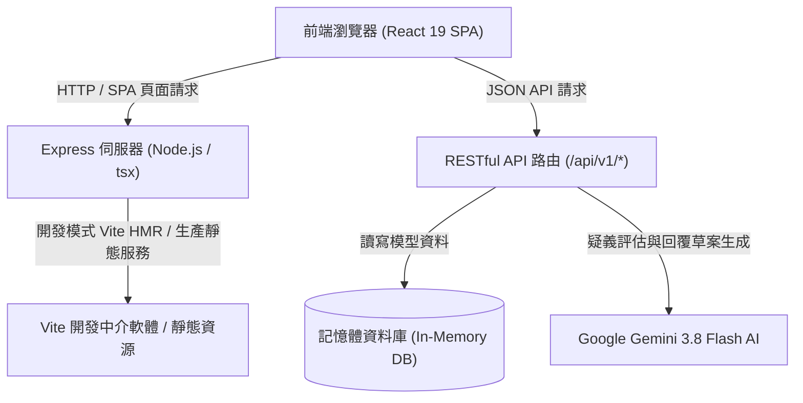
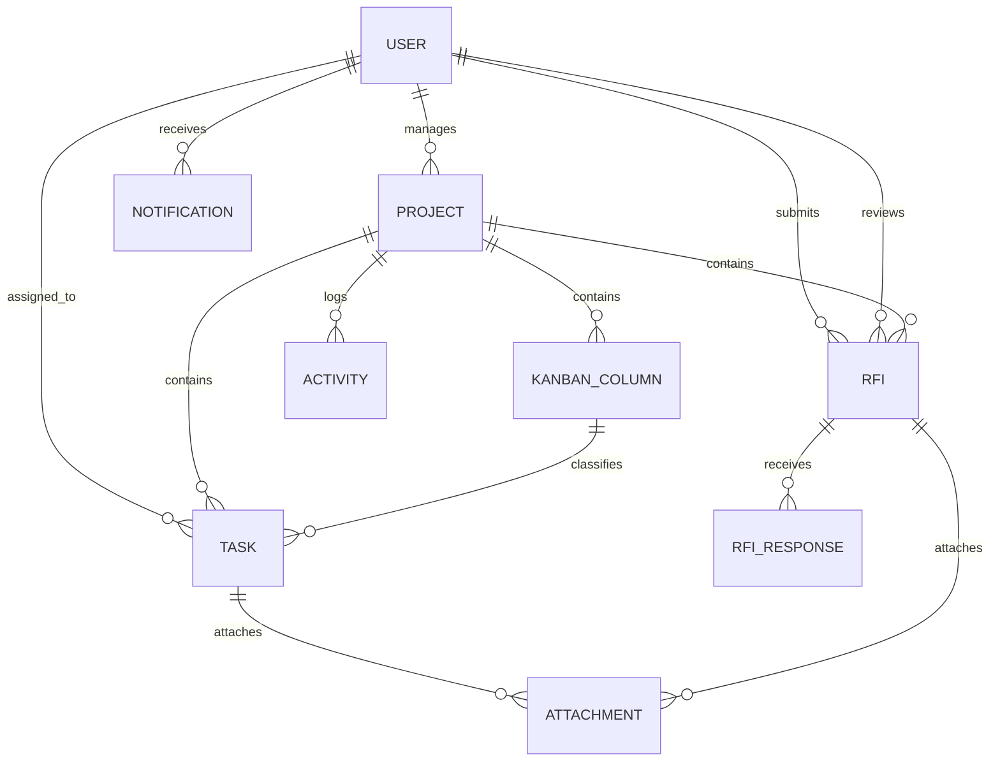

# 系統設計文件 (System Design Document)

## 1. 專案概述 (Project Overview)

**專案名稱**：營建機電工程專案管理與 RFI 追蹤系統 (REI Architecture & Engineering Project Management System)  
**定位**：專為高科技廠房、潔淨室與大型營建機電統包工程設計之敏捷專案管理平台。結合敏捷看板 (Kanban Board)、工程疑義單追蹤 (Request For Information, RFI)、圖面與照片附件管理，並整合 Google Gemini 3.8 Flash 智慧工程顧問深度分析技術。

---

## 2. 系統架構 (System Architecture)

本專案採全端整合架構（Full-Stack Integrated Architecture），後端使用 Express.js 搭配記憶體資料庫 (In-Memory Database) 提供高效 RESTful API，並於開發環境整合 Vite 中介軟體提供前端 SPA 即時熱重載 (HMR)，生產環境則可直接輸出靜態檔案與單一執行檔。



---

## 3. 技術棧 (Technology Stack)

### 前端 (Frontend)
- **核心框架**：React 19 (`react`, `react-dom`)
- **建置工具**：Vite 6 (`@vitejs/plugin-react`)
- **樣式系統**：Tailwind CSS v4 (`@tailwindcss/vite`, `tailwindcss`)
- **圖標庫**：Lucide React (`lucide-react`)
- **動畫庫**：Motion (`motion`)
- **語言標準**：TypeScript 5.8 (嚴格型別檢查)

### 後端 (Backend)
- **應用伺服器**：Express.js 4 (`express`, `@types/express`)
- **執行環境**：Node.js v20+ / tsx (TypeScript Execute)
- **環境設定**：dotenv (`dotenv`)
- **打包工具**：esbuild (後端打包輸出 CommonJS/CJS)
- **人工智慧**：Google Gen AI SDK (`@google/genai`)

### 本地環境與作業腳本 (Local Environment & Automation)
- **本地執行端口**：預設 Port `3000` (可由 `.env` 自訂)
- **行程生命週期管理**：`.server.pid` 行程識別、`SIGINT` / `SIGTERM` / `exit` 安全回收機制
- **自動化啟閉腳本**：
  - Windows 批次檔：`start_server.bat` (開箱即用雙擊啟動、自動開啟瀏覽器)、`stop_server.bat` (強制釋放 Port 3000)
  - PowerShell 腳本：`start_server.ps1`、`stop_server.ps1` (UTF-8 BOM 編碼，支援 Windows 繁中環境)

---

## 4. 資料模型設計 (Data Schema)

系統採用工程實務標準的 ER 模型架構，於後端維護下列實體：



### 核心實體清單
1. **使用者 (User)**：包含工號、姓名、電子信箱、角色權限（`SUPER_ADMIN`, `PM`, `MEMBER`, `REVIEWER`）、職稱與部門。
2. **專案 (Project)**：包含專案代號（如 `PRJ-TECH`, `PRJ-HVAC`）、專案名稱、工程範疇描述與負責 PM。
3. **看板欄位 (Kanban Column)**：各專案獨立的看板流程（如待處理、進行中、待審核、已完成），支援自訂顏色與排序。
4. **任務 (Task)**：工程任務卡片，包含任務編號（如 `TSK-101`）、優先級（`URGENT`, `HIGH`, `MEDIUM`, `LOW`）、起訖日期、主負責人與協同人員、標籤及圖面附件。
5. **工程疑義 (RFI, Request For Information)**：
   - 編碼格式：`{PROJECT_CODE}-RFI-{YEAR}-{0001}`（例如 `PRJ-TECH-RFI-2026-0001`）
   - 狀態機：`SUBMITTED` (已提交) -> `IN_REVIEW` (審查中) -> `ANSWERED` (已回覆) -> `CLOSED` (已結案)
   - 工程評估欄位：關聯圖號、合約技術規範條款、工期影響天數評估、追加減成本評估。
6. **RFI 回覆記錄 (RFI Response)**：審查專家與監造單位的正式技術回覆草案與簽核記錄。
7. **附件 (Attachment)**：支援任務或 RFI 附加工程圖面、現場施工照片，支援 Base64 快速上傳與圖片燈箱預覽。
8. **通知 (Notification)**：任務指派、RFI 提送與審查簽核之即時通知，支援已讀與全部已讀。
9. **活動日誌 (Activity Audit Log)**：完整記錄人員於專案內的所有工程異動軌跡。

---

## 5. 前端組件結構 (Component Hierarchy)

```
App.tsx (主應用程式骨架、頂部導航、身分切換、專案切換)
│
├── KanbanBoard.tsx (敏捷看板視圖、欄位卡片管理、拖曳/排序移動)
│   └── TaskModal.tsx (新增/編輯任務彈窗、上傳圖面、人員指派)
│
├── RFITracker.tsx (工程疑義追蹤總表、狀態篩選、關鍵字檢索、時限警示)
│   ├── NewRFIModal.tsx (建立新 RFI 彈窗、圖號引用、時程成本評估、剪貼簿圖片貼上)
│   └── RFIDetailModal.tsx (RFI 詳情檢視、AI 智慧分析、簽核回覆歷程)
│
├── MyTasksDashboard.tsx (個人工作台：我的任務、待審查項目、逾期警示統計)
├── NotificationCenter.tsx (右上角通知中心下拉面板)
└── LightboxViewer.tsx (全螢幕施工圖面與照片預覽檢視器)
```

---

## 6. AI 智慧工程顧問設計 (Gemini Engineering Integration)

### 提示詞工程 (Prompt Engineering)
- **角色定位**：20 年高科技廠房與機電工程統包資深工程總監 (PE, Professional Engineer)。
- **分析維度**：
  1. 【工程技術問題解析與規範校核】：根本肇因剖析、物理空間/電氣安全/管線干涉校核。
  2. 【工期與成本影響性評估】：關鍵路徑衝擊分析、建議工期增減天數、成本追減方針。
  3. 【官方回覆建議 (Draft Official Response)】：產出可直接由監造顧問簽署之正式回覆文稿。
- **多模態能力**：支援現場施工照片、管線套圖 Base64 輸入進行圖文多模態分析。
- **降級機制 (Graceful Fallback)**：當本機未設定 `GEMINI_API_KEY` 時，系統自動啟動內建之智慧工程模擬評估模式，各項介面與回覆流程皆能流暢體驗。

---

## 7. 部署與本機維運原則 (Operation Principles)

1. **環境變數隔離**：所有本機敏感設定（如 API Key、Port）皆收納於 `.env`，不推入版本控制。
2. **端口防佔用設計**：透過 `stop_server.bat` / `stop_server.ps1` 確保 Windows 環境下 Node/tsx 行程可被乾淨終止，杜絕 `EADDRINUSE` 錯誤。
3. **開箱即用體驗**：雙擊 `start_server.bat` 即可完成依賴確認、環境配置、伺服器啟動與瀏覽器連線。
